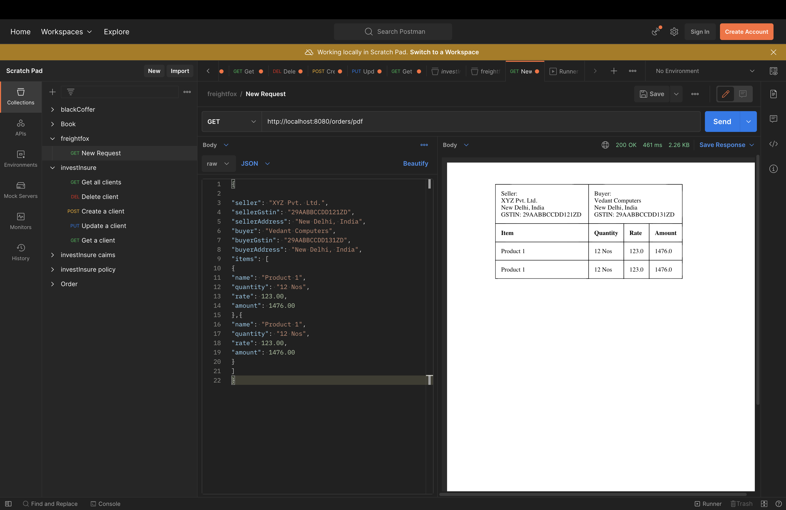

# pdfGenerator
## How to run:
Use spring:bootrun command 

## Input:

```
{

  

"seller": "XYZ Pvt. Ltd.",

"sellerGstin": "29AABBCCDD121ZD",

"sellerAddress": "New Delhi, India",

"buyer": "Vedant Computers",

"buyerGstin": "29AABBCCDD131ZD",

"buyerAddress": "New Delhi, India",

"items": [

{

"name": "Product 1",

"quantity": "12 Nos",

"rate": 123.00,

"amount": 1476.00

},{

"name": "Product 1",

"quantity": "12 Nos",

"rate": 123.00,

"amount": 1476.00

}

]

}
```
# Output:

